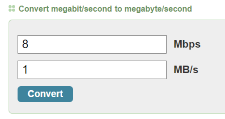
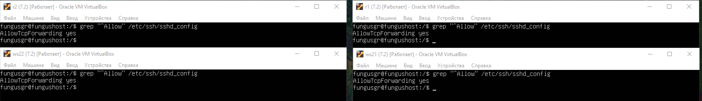
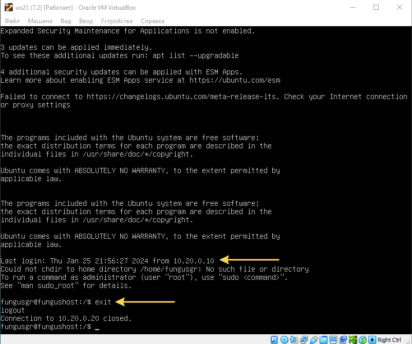

  

## Содержание D02_Linux-Network
1. [Инструмент ipcalc](#part-1-инструмент-ipcalc)  
2. [Статическая маршрутизация между двумя машинами](#part-2-статическая-маршрутизация-между-двумя-машинами)  
3. [Утилита iperf3](#part-3-утилита-iperf3)  
4. [Сетевой экран](#part-4-сетевой-экран)    
5. [Статическая маршрутизация сети](#part-5-статическая-маршрутизация-сети)  
6. [Динамическая настройка IP с помощью DHCP](#part-6-динамическая-настройка-ip-с-помощью-dhcp)  
7. [NAT](#part-7-nat)  
8. [Допополнительно. Знакомство с SSH Tunnels](#part-8-дополнительно-знакомство-с-ssh-tunnels)  
9. [Материалы, прочитанные и просмотренные, во время и для выполнения задания](#материалы-прочитанные-и-просмотренные-во-время-и-для-выполнения-задания)  


## Реализованные требования к проекту `D01_Linux-1`

В качестве результата работы предоставлен отчет по выполненным задачам:  
- В репозиторий, в папку src, загружен отчёт - файл `README.md`  
- Отчёт оформлен в виде списка  
- Каждый скриншот в отчёте подписан    
- Все части задания в отчёте, выделены заголовками 2-го уровня  
- Все скриншоты обрезаны так, чтобы была видна только нужная часть экрана  
- На одном скриншоте допускается отображение сразу нескольких пунктов задания, но они все должны быть описаны в подписи к скриншоту  
- На все виртуальные машины, созданные в процессе выполнения задания, установлен **Ubuntu 20.04 Server LTS**  


## Part 1 Инструмент **ipcalc**

<details>
  <summary>1.1 Сети и маски</summary>
</p>

Поднял виртуальную машину клонированием машины из предыдущего задания ws1 по инструкции [отсюда](materials/static_routing.md)

Для определения адреса сети для подсети 192.167.38.54/13 использую утилиту `ipcalc`  
Для установки использовал команду `sudo apt install ipcalc`  

1) Определяю адрес сети для подсети 192.167.38.54/13 командой `ipcalc 192.167.38.54/13`  

     

   > На скриншоте в выводе команды мы видим:  
   > слева результаты вывода в виде десятичной записи, справа - двоичной  
   > - Address - это ip адрес, который мы ввели  
   > - Netmask - это маска подсети    
   > - Wildcard - это обратная маска  
   > - Network - это адрес сети, в которой находится наш IP  
   > - Hostmin - самый первый (минимальный) доступный IP адрес для хостов  
(Мы видим, что он 192.160.0.1, тк хосты не могут использовать адрес 192.160.0.0  т.к. это адрес сети)  
   > - HostMax - последний доступный IP адрес для хостов  
   > - Broadcast - это адрес широковещательной рассылки  
   > - Hosts/Net - показывает сколько всего доступно ip адресов для хостов  
   >  

2) Перевод масок:  

   - *255.255.255.0* в префиксную и двоичную запись  
   - */15* в обычную и двоичную  
   > Чтобы узнать адрес подсети для сети /15, запускаем команду `ipcalc 0.0.0.0/15`  
   > Это значит, что мы хотим узнать маску подсети для сети с начальным адресом 0.0.0.0 и префиксом /15  
   > Можно использовать также 255.255.255.0, что является конечным адресом в подсети   
   >     

   - *11111111.11111111.11111111.11110000* в обычную и префиксную   

   > Переводим маску 11111111.11111111.11111111.11110000 из двоичной формы в префиксную, тк ipcalc не работает с масками в таком виде  
   > Это просто: считаем количество единиц и пишем это число после слэша   
   > Чтобы запустить это в ipcalc, вводим маску 0.0.0.0/28  
   >  

      


3) Минимальный и максимальный хост в сети *12.167.38.4* при заданных масках:  

   - Минимальный и максимальный хост в сети *12.167.38.4* с маской */8*  

     

   - Минимальный и максимальный хост в сети *12.167.38.4* с маской */16* или *11111111.11111111.00000000.00000000*  

     

   - Минимальный и максимальный хост в сети *12.167.38.4* с маской *255.255.254.0*    

     

   - Минимальный и максимальный хост в сети *12.167.38.4* с маской */4*    

     

</p>
</details>


<details>
  <summary>1.2 localhost</summary>
</p>

Определил через `ping`, можно ли обратиться к приложению, работающему на localhost, со следующими IP:  

 - *194.34.23.100* - нет ответа от сервера  
 - *127.0.0.2* - работает    
 - *127.1.0.1* - работает  
 - *128.0.0.1* - нет ответа от сервера   

  

Тут можно было и не пинговать, но интересно было проверить))   
В localhost будут работать только адреса в диапазоне *127.0.0.0* — *127.255.255.255*  
[Именно они зарезервированы для интерфейсов обратной петли](materials/ipcalc.md) и не используются для коммуникации в сети  

</p>
</details>


<details>
  <summary>1.3 Диапазоны и сегменты сетей</summary>
</p>

Определил и записал в отчёт:

1) какие из перечисленных IP можно использовать в качестве публичного, а какие только в качестве частных:  

   > Следующие диапазоны адресов зарезервированы для частных (также известных как LAN) сетей:  
   > - *10.0.0.0* — *10.255.255.255* (*10.0.0.0/8*)  
   > - *172.16.0.0* — *172.31.255.255* (*172.16.0.0/12*)  
   > - *192.168.0.0* — *192.168.255.255* (*192.168.0.0/16*)  
   > - *127.0.0.0* — *127.255.255.255*   
   > 

    |         Адрес         |  Публичный  |   Частный    |
    | --------------------- |------------ | ------------ |
	|     134.43.0.2        |     ДА      |              |
	|     172.0.2.1         |     ДА      |              |
	|     192.172.0.1       |     ДА      |              |
	|     172.68.0.2        |     ДА      |              |
	|     192.169.168.1     |     ДА      |              |
	|     10.0.0.45         |             |      ДА      |
	|     192.168.4.2       |             |      ДА      |
	|     172.20.250.4      |             |      ДА      |
	|     172.16.255.255    |             |      ДА      |
	|     10.10.10.10       |             |      ДА      |


2) какие из перечисленных IP адресов шлюза возможны у сети *10.10.0.0/18*:  

	Использую `ipcalc 10.10.0.0/18` чтобы найти максимальный и минимальный хосты  

	  

	|      Адрес      |  Возможен   |  Невозможен  |
    | --------------- |------------ | ------------ |
	|  10.10.0.2      |     ДА      |              |
	|  10.10.10.10    |     ДА      |              |
	|  10.10.1.255    |     ДА      |              |
	|  10.10.100.1    |             |      ДА      |
	|  10.0.0.1       |             |      ДА      |

</p>
</details>


## Part 2 Статическая маршрутизация между двумя машинами

<details>
  <summary>2.1 netplan</summary>
</p>

Поднял вторую виртуальную машину ws2   
С помощью команды `ip a` вывел существующие сетевые интерфейсы ws1 и ws2   

  


Отредактировал файл сетевого интерфейса командой `sudo vi etc/netplan/00-installer-config.yaml` на обеих машинах и задал следующие адреса и маски:  
- ws1: адрес *192.168.100.10*, маска */16*  
- ws2: адрес *172.24.116.8*, маска */12*   

Выполнил команду `sudo netplan apply` для перезапуска сервиса сети на обеих машинах   

    
</p>
</details>


<details>
  <summary>2.2 Добавление статического маршрута вручную</summary>
</p>

Добавил сеть для тестируемых машин в VirtualBox в `Машина -> Настроить -> Сеть -> Адаптер 2 -> Тип Подключения -> Имя`     
По инструкции [отсюда](materials/static_routing.md)  

  

В выводе `ip a` появился новый сетевой интерфейс **enp0s8**  

  

Его статус DOWN, чтобы его поднять вызвал `sudo ip link set enp0s8 up` и проверил с `ip a`  

  

Добавил статический маршрут между ws1 и ws2 при помощи команд вида `ip r add <host_IP>/<netmask> <IP_gateway>`  
Проверил добавление нового соединения с `ip r` и пропинговал его с `ping -c 3`   

   

> Ключ `-с` в команде `ping` позволяет задать сколько раз пинговать  
</p>
</details>


<details>
  <summary>2.3 Добавление статического маршрута с сохранением</summary>
</p>

Перезапустил машины командой `reboot`и проверил существующие соединения через `ip r`  
Cтатическая сеть, созданная на предыдущем шаге не работает  

Добавил статический маршрут от одной машины до другой командой `sudo vi etc/netplan/00-installer-config.yaml`  
Применил настройки файла конфига командой `sudo netplan apply`
Проверил соединение `ip r`  
Пропинговал соединение между машинами  

  

Перезапустил машины командой `reboot`и проверил существующие соединения через `ip r`  

  

В отличие от статической сети, статический маршрут все ещё работает  

</p>
</details>


## Part 3 Утилита **iperf3**

*В задании используются виртуальные машины ws1 и ws2 из Part 2*

<details>
  <summary>3.1 Скорость соединения</summary>
</p> 

Базовой единицей скорости передачи информации является бит в секунду (bps).  
Разница между байтами в секунду (B/s) и битами в секунду (bps) такая же, как разница между байтами и битами: 1 B/s = 8 bps.  
Аналогично разница между килобайтами в секунду (KB/s) и B/s такая же, как разница между килобайтами и байтами: 1 KB/s = 1024 B/s. И так далее.  

Таким образом: 

  

</p>
</details>


<details>
  <summary>3.2 Измерить скорость соединения между ws1 и ws2</summary>
</p>

Измерил скорость соединения между ws1 и ws2 по инструкции [отсюда](materials/iperf3.md)  
Для установки использовал команду `sudo apt install iperf`  

Результаты теста с хостом wc1  

  

Результаты теста с хостом wc2  

  

</p>
</details>


## Part 4 Сетевой экран


*В задании используются виртуальные машины ws1 и ws2 из Part 2*

<details>
  <summary>4.1 Утилита iptables</summary>
</p>

> Iptables - это мощный инструмент управления сетью в Linux, который позволяет администраторам управлять входящими и исходящими пакетами данных.  
Это основной инструмент для настройки межсетевых экранов в системах Linux.  
> 
> Для чего нужна iptables:  
>  - Блокировка IP-адреса, например: `iptables -A INPUT -s IP_АДРЕС -j DROP`  
>  - Открытие порта для входящего трафика, например: `iptables -A INPUT -p tcp --dport НОМЕР_ПОРТА -j ACCEPT`  
>  - Настройка межсетевого экрана  
>  - Логирование  
>  - Создание пользовательских цепочек  
>  - Использование состояний пакетов  
>  - Создание VPN  
>  - Ограничение скорости  
>  - Перенаправление трафика  
> 

Создал файл /etc/firewall.sh, имитирующий фаерволл, на ws1 и ws2 и добавил в него подряд следующие правила:  

- открыл на машинах доступ для порта 22 (ssh) и порта 80 (http)  
- добавил запрет *echo reply* в соответствии с выбранной стратегией  
- добавил разрешение *echo reply* (машина должна "пинговаться") в соответствии с выбранной стратегией 

1) на ws1 применил стратегию, когда в начале пишется запрещающее правило, а в конце пишется разрешающее правило  
2) на ws2 применил стратегию, когда в начале пишется разрешающее правило, а в конце пишется запрещающее правило   

  

Запустил файлы на обеих машинах командами `chmod +x /etc/firewall.sh` и `/etc/firewall.sh`

  

> Правила в iptables выполняются сверху-вниз. Если правило запрета находится выше - оно срабатывает, а правило разрешения, находящееся ниже - нет.  
> 
> Когда в начале идут разрешающие правила, все пакеты будут проверяться в первую очередь на соответствие разрешающим правилам.  
Только если ни одно из них не подошло, пакет будет отброшен запрещающим правилом в конце.   
> В случае, когда в начале идут запрещающие правила, пакет будет сразу отброшен, если не соответствует ни одному из разрешающих правил.  
Запрещающее правило, стоящее первым, имеет приоритет перед последующим разрешающим.  
> 
> Таким образом ws1 не пингуется, а ws2 пингуется.  


</p>
</details>


<details>
  <summary>4.2 Утилита nmap</summary>
</p>

> Nmap - это утилита для сканирования сетей и систематизации портов и устройств в сети. Она может быть использована для поиска уязвимостей в системах, а также для мониторинга и анализа сетевых соединений.
> 
> Основные функции nmap:
> - Сканирование портов: nmap может сканировать все порты на аппаратном и программном уровне, чтобы определить, какие порты открыты и какие службы запущены на них  
> - Сканирование сетей: nmap может сканировать все устройства в сети и определить, какие интерфейсы есть в сети и какие устройства подключены к ним  
> - Сканирование соединений: nmap может сканировать все сетевые соединения и определить, какие устройства с какими портами связаны   
> - Мониторинг сети: nmap может мониторить изменения в сети и оповещать об изменениях, таких как добавление или удаление устройств, изменение конфигурации и тп.  
> 

Командой **ping** нашёл машину, которая не "пингуется"    
Усановил **nmap** командой `sudo apt install nmap`, после вызвал **nmap** с адресом этой машины    
> Ключ `-sV` команды `nmap` включает детальное исследование портов для определения версий служб  

  

Сохранил дампы образов виртуальных машин  

  

</p>
</details>


## Part 5 Статическая маршрутизация сети

<details>
  <summary>5.1 Настройка адресов машин</summary>
</p>


Настроил конфигурации машин в etc/netplan/00-installer-config.yaml согласно сети на рисунке  

Поднял три машины и два роутера:

 - машина ws11 c адресом 10.10.0.2/18 соединяется с сетью 10.10.0.0/18 через сетевой интерфейс enps08   
 - машина ws21 с адресом 10.20.0.10/26 соединяется с сетью 10.20.0.0/26 через сетевой интерфейс enps08   
 - машина ws22 с адресом 10.20.0.20/26 соединяется с сетью 10.20.0.0/26 через сетевой интерфейс enps08   

 - роутер r2 с адресом 10.20.0.1/26 соединяются с сетью 10.20.0.0/26 через сетевой интерфейс enps09  
 - роутер r2 с адресом 10.100.0.12/16 соединяются с сетью 10.100.0.0/16 через сетевой интерфейс enps08  

 - роутер r1 с адресом 10.100.0.11/16 соединяется с сетью 10.100.0.0/16 через сетевой интерфейс enps09  
 - роутер r1 с адресом 10.10.0.1/18 соединяется с сетью 10.10.0.0/18 через сетевой интерфейс enps08  


  
  

Применил настройки на каждой машине командой `sudo netplan apply`  
Перезапустил машины командой `reboot`  
Проверил настройки командой `ip -4 a`  

  
  

Пропинговал ws22 с ws21 и r1 с ws11  

  


</p>
</details>


<details>
  <summary>5.2 Включение переадресации IP-адресов</summary>
</p>

> Команда `sysctl -w net.ipv4.ip_forward=1` - это команда, которая устанавливает параметр ip_forward для сетевого протокола IPv4 в режим "включен".  
Это означает, что ваша система начнет работать в режиме маршрутизатора, позволяя передавать пакеты между различными сетевыми интерфейсами и сетями. 
> 
> При использовании этой команды, ваша система будет способна направлять пакеты от одного сетевого интерфейса к другому, что позволяет создать простой маршрутизатор или настроить передачу трафика через виртуальную машину.

Для включения переадресации IP, выполнил команду на роутерах: `sudo sysctl -w net.ipv4.ip_forward=1`  
*При таком подходе переадресация не будет работать после перезагрузки системы.*

  

Добавил в файл */etc/sysctl.conf* строку: `net.ipv4.ip_forward = 1`  
Применил настройки командой `sudo sysctl -p`  
*При использовании этого подхода, IP-переадресация включена на постоянной основе.*
В отчёт поместить скрин с содержанием изменённого файла */etc/sysctl.conf*.  

  

> Команда "sudo sysctl -p" применяет любые изменения, внесенные в файл конфигурации системного ядра, который обычно находится в /etc/sysctl.conf.  
Этот файл содержит параметры конфигурации ядра операционной системы Linux.

</p>
</details>


<details>
  <summary>5.3 Установка маршрута по-умолчанию</summary>
</p>

Настроил маршрут по-умолчанию (шлюз) для рабочих станций  
Для этого добавил `routes: -to: default` перед IP роутера в файле конфигураций  

  

В выводе `ip r` видно маршрут в таблице маршрутизации  

  

Пропинговал с ws11 роутер r2 и показал на r2, что пинг доходит  
Для этого использовал команду: `sudo tcpdump icmp and src host 10.10.0.2 -tn -i enp0s9`  

  

> Команда `tcpdump` используется для захвата и отображения трафика на конкретном сетевом интерфейсе.  
Описание использованных ключей:  
`-t`: отключает вывод временных меток. Полезно, если нужно только содержимое пакетов.  
`-n`: не отображать доменные имена. Полезно для улучшения производительности и избежания задержек, связанных с попытками разрешения имен хостов.  
`-i`: какой сетевой интерфейс будем отслеживать, в данном случае *enp0s9*.  
`icmp`: означает, что мы хотим отобразить только ICMP-пакеты пинга.  
`src host 10.10.0.2`: указывает tcpdump выводить только пакеты, отправленные с указанного хоста 10.10.0.2.  

</p>
</details>


<details>
  <summary>5.4 Добавление статических маршрутов</summary>
</p>

Добавил в роутеры r1 и r2 статические маршруты в файле конфигураций  

```shell
# Пример для r1 маршрута в сетку 10.20.0.0/26:  
- to: 10.20.0.0  # куда
  via: 10.100.0.12 # через
```

  

Применил настройки командой `sudo netplan apply`  

Вызвал `ip r` и показал таблицы с маршрутами на обоих роутерах. 

```shell
# Пример таблицы на r1:  
10.10.0.0/18 dev eth0 proto kernel scope link src 10.10.0.1  
10.20.0.0/26 via 10.100.0.12 dev eth1  
10.100.0.0/16 dev eth1 proto kernel scope link src 10.100.0.11  
```

  

Запустил команды на ws11: `ip r list 10.10.0.0/18` и `ip r list 0.0.0.0/0`  

  

> Маршрут 0.0.0.0/0 представляет собой маршрут по умолчанию, который используется для перенаправления всех пакетов, не совпадающих с другими определенными маршрутами, на указанный шлюз по умолчанию. Однако, при наличии более конкретного маршрута по умолчанию в этой сети, он будет приоритетно использоваться для маршрутизации трафика.    


</p>
</details>


<details>
  <summary>5.5 Построение списка маршрутизаторов</summary>
</p>


```shell
# Пример вывода утилиты traceroute:
1 10.10.0.1 0 ms 1 ms 0 ms
2 10.100.0.12 1 ms 0 ms 1 ms
3 10.20.0.10 12 ms 1 ms 3 ms
```
Установил **traceroute** командой `sudo apt install inetutils-traceroute`  

Запустил на r1 команду дампа командой `sudo tcpdump -tnv -i eth0`  
> Описание использованных ключей `tcpdump`:  
`-v`: включает подробное отображение пакетов (verbose mode), а именно отображение заголовков пакетов с большей детализацией  

При помощи утилиты **traceroute** построил список маршрутизаторов на пути от ws11 до ws21  
Для этого на ws11 запустил команду `traceroute 10.20.0.10` с адресом машины ws21   

  

> Traceroute использует принцип отправки UDP пакетов по маршруту к целевому узлу.  
Каждый пакет содержит увеличивающийся счетчик TTL (Time to Live), изначально установленный в 1.  
Когда пакет достигает маршрутизатора, счетчик TTL уменьшается на 1.  
Когда счетчик TTL достигает нуля, маршрутизатор отбрасывает пакет и отправляет обратно сообщение (time exceeded) и traceroute записывает адрес этого маршрутизатора.  
Затем процесс повторяется с увеличенным TTL, что позволяет traceroute отслеживать каждый шаг пути до целевого узла.  

> UDP (User Datagram Protocol)
Этот протокол используется для «связи без установки соединения» (connectionless communication).  
Один узел сети отсылает пакеты, адресуя их другому узлу. Отправитель не знает ничего о том, готов ли получатель к приёму пакетов, и вообще, существует ли этот получатель.  
Отправитель также не ждёт какого-либо подтверждения о том, что получатель принял предыдущие пакеты.  
> 
> Ключевой момент в использовании протокола UDP в утилите traceroute заключается в его ненадежности и неблокирующей природе. Поскольку основная цель traceroute - отслеживание пути до конечного узла, стабильная и надежная передача данных не является первостепенной. Вместо этого, traceroute предпочитает скорость и простоту для быстрого обнаружения промежуточных маршрутизаторов и определения времени прохождения данных через каждый из них. Протокол UDP, в отличие от TCP, не устанавливает устойчивое соединение и не требует ответа на каждый отправленный пакет, что позволяет более эффективно определять маршрут и адреса промежуточных узлов на пути следования пакетов.  
Термин "ненадежность" в данном контексте означает, что протокол UDP не гарантирует надежной доставки данных.  
В случае использования TCP, требовалось бы установить устойчивое соединение между отправителем и получателем, что привело бы к более надежной, но также более медленной передаче.  
"Неблокирующая природа" UDP означает, что он не ждет подтверждения доставки каждого пакета, что делает его более быстрым и подходящим для утилиты типа traceroute.


</p>
</details>


<details>
  <summary>5.6 Использование протокола ICMP при маршрутизации</summary>
</p>

> ICMP (Internet Control Message Protocol) - это протокол сетевого уровня, используемый в сети интернет для передачи сообщений об ошибках, диагностики сети и управления трафиком.  
ICMP-пакеты обычно не используются для передачи данных, как это делает протокол TCP или UDP, но они играют важную роль в обнаружении и устранении проблем в сети.  
> Некоторые из распространенных использований ICMP-пакетов включают сообщения об ошибках (например, когда хост недоступен), сообщения о запросе эха (используемые, например, командой ping для проверки связанности сети) и сообщения о параметрах.

Запустил на r1 перехват сетевого трафика, проходящего через eth0(в моём случае enp0s8) с помощью команды: `sudo tcpdump -n -i enp0s8 icmp`   
Пропинговал с ws11 несуществующий IP 10.30.0.111 с помощью команды: `ping -c 1 10.30.0.111`  

  

Сохранил дампы образов виртуальных машин  

</p>
</details>


## Part 6. Динамическая настройка IP с помощью **DHCP**

*В задании используются виртуальные машины из Части 5*  


<details>
  <summary>6.1 Настроить конфигурацию службы DHCP</summary>
</p>

Установил сервис DHCPD командой `sudo apt install isc-dhcp-server`

Для r2 настроил в файле `/etc/dhcp/dhcpd.conf` адрес маршрутизатора по-умолчанию, DNS-сервер и адрес внутренней сети   

  

В файле `/usr/lib/systemd/resolv.conf` прописал `nameserver 8.8.8.8.`  

  

Перезагрузил службу **DHCP** командой `sudo systemctl restart isc-dhcp-server`   
Проверил статус после перезапуска сервиса командой `sudo systemctl status isc-dhcp-server`  

  

Машину ws21 перезагрузил при помощи `reboot` и через `ip a` показал, что она получила адрес  
Пропинговал ws22 с ws21   

  

</p>
</details>


<details>
  <summary>6.2 Настроить MAC адреса</summary>
</p>

> МАС адрес (media access control address) – уникальный идентификатор, назначенный сетевому адаптеру.  
Применяется в сетях стандартов IEEE 802: в основном Ethernet, Wi-Fi и Bluetooth.  
Официально называется «идентификатором типа EUI-48» и имеет длину в 48 бит, т.е. 6 байт.  
Общепринятого стандарта на написание адреса нет (в противоположность IPv4 адресу, где октеты всегда разделяют точками).  
Обычно он записывается как шесть шестнадцатеричных чисел, разделенных двоеточием: 00:AB:CD:EF:11:22  

Указал MAC адрес ws11, для этого в `etc/netplan/00-installer-config.yaml` добавил: `macaddress: 10:10:10:10:10:BA`, `dhcp4: true`  
Применил настройки командой `sudo netplan apply`  

  

Для r1 настроил в файле `/etc/dhcp/dhcpd.conf` адрес маршрутизатора по-умолчанию, DNS-сервер и адрес внутренней сети с жесткой привязкой к MAC-адресу (ws11)    

  

В файле `/usr/lib/systemd/resolv.conf` прописал `nameserver 8.8.8.8.`  

  

Перезагрузил службу **DHCP** командой `sudo systemctl restart isc-dhcp-server`   
Проверил статус после перезапуска сервиса командой `sudo systemctl status isc-dhcp-server`  

  

Прописал MAC-адрес в настройках сетевого адаптера  

  

Машину ws11 перезагрузил при помощи `reboot` и через `ip a` показал, что она получила адрес  
Пропинговал r1 с ws11   

  

</p>
</details>


<details>
  <summary>6.3 Обновление ip адреса</summary>
</p>

Обновил ip на машине ws21  
Ввёл `ip -4` a чтобы вывести текущий ip  
Использовал `sudo dhclient -r enp0s8` для освобождения ip адреса  
Запросил обновление ip адреса командой `sudo dhclient -r enp0s8`  
Загрузил скрин c ip до и после обновления    

  

Сохранил дампы образов виртуальных машин

</p>
</details>


## Part 7. **NAT**

*В задании используются виртуальные машины из Части 5*  

<details>
  <summary>7.1 Запустить общедоступный веб-сервер Apache2</summary>
</p>

Установил Apache2 на ws22 командой `sudo apt install apache2`  

> Все настройки содержатся в папке /etc/apache/:  
> 
> /etc/apache2/apache2.conf отвечает за основные настройки  
/etc/apache2/conf-available/* - дополнительные настройки веб-сервера  
/etc/apache2/mods-available/* - настройки модулей  
/etc/apache2/sites-available/* - настойки виртуальных хостов  
/etc/apache2/ports.conf - порты, на которых работает apache  
/etc/apache2/envvars  

В файле */etc/apache2/ports.conf* на ws22 и r1 изменил строку `Listen 80` на `Listen 0.0.0.0:80`, то есть сделал сервер Apache2 общедоступным  
Запустил веб-сервер Apache командой `service apache2 start` на ws22 и r1  

  

</p>
</details>


<details>
  <summary>7.2 Настроить фаервол</summary>
</p>

Создал файл /etc/firewall.sh на r2 и добавил в него подряд следующие правила:  
1) Удаление правил в таблице filter - `iptables -F`  
2) Удаление правил в таблице "NAT" - `iptables -F -t nat`  
3) Отбрасывать все маршрутизируемые пакеты - `iptables --policy FORWARD DROP`  

Запустил файл командой `sudo chmod +x /etc/firewall.sh && sudo /etc/firewall.sh`  

Проверил соединение между ws22 и r1 командой `ping`  
При запуске файла с этими правилами, r1 не пингуется с ws22  

  


Добавил в файл ещё одно правило:   
4) Разрешил маршрутизацию всех пакетов протокола ICMP - `iptables -A FORWARD -p icmp -j ACCEPT`  
Проверил соединение между ws22 и r1 командой `ping`  
При запуске файла с этими правилами, r1 пингуется с ws22  

  

Добавил в файл ещё три правила:  
5) Включил **SNAT**, а именно маскирование всех локальных ip из локальной сети, находящейся за r2 (по обозначениям из Части 5 - сеть 10.20.0.0)  
Для этого юзаю команду `iptables -t nat -A POSTROUTING -s 10.20.0.0/26 -j SNAT --to 10.100.0.12`  
6) Включил **DNAT** на 8080 порт машины r2 и добавил к веб-серверу Apache, запущенному на ws22, доступ извне сети  
Для этого юзаю команду `iptables -t nat -A PREROUTING -p tcp --dport 8080 -j DNAT --to-destination 10.20.0.20:80`  
7) Чтобы эти правила работали разрешаю маршрутизацию tcp-пакетов и ставлю перед ними `iptables -A FORWARD -p tcmp -j ACCEPT`  

  

Запустил файл командой `sudo /etc/firewall.sh`  
Перед тестированием отключил сетевой интерфейс с NAT 

  

Проверил tcp-соединение **SNAT** с ws22 на r1 командой: `telnet 10.10.0.1 80`  
Проверил tcp-соединение **DNAT**с r1 на ws22 через адрес r2 и порт 8080 командой `telnet 10.100.0.12 8080`      

  

Сохранил дампы образов виртуальных машин    

</p>
</details>


## Part 8. Дополнительно. Знакомство с **SSH Tunnels**

*В задании используются виртуальные машины из Части 5*

<details>
  <summary>Local TCP forwarding</summary>
</p>

> **Local TCP forwarding** - локальное TCP-перенаправление  
> Удобно использовать в тех случаях, когда нужно направлять трафик между различными портами или узлами в пределах одной локальной сети.  
> 

Запустил на r2 фаервол с правилами из Части 7  

  


Чтобы с помощью *Local TCP forwarding* с ws21 до ws22 получить доступ к веб-серверу на ws22 с ws21 выполнил пять шагов:  

1 - запустил веб-сервер apache2 на localhost ws22 и в файле */etc/apache2/ports.conf* изменил строку `Listen 80` на `Listen localhost:80`  
2 - перезапустил apache2 и проверил статус      

  

3 - в файле */etc/ssh/sshd_config* раскомментировал строку `AllowTcpForwarding yes` чтобы разрешить маршрутизацию по ssh   

  

4 - перезапустил ssh на машине ws22 и проверил прослушиваемые порты  

  

> Использованные ключи команды `netstat`:  
> 
> - `t`: отображает только TCP-соединения, исключая UDP и другие протоколы  
> - `u`: отображает только UDP-соединения  
> - `l`: отображает только прослушиваемые порты, т.е. порты, на которых серверы слушают входящие соединения  
> - `n`: отображает портов номера и IP-адреса в числовом формате, а не пытается выполнять обратное разрешение DNS для представления их символьных имен  

5 - создал локальный порт 2024 на ws21, для переадресации трафика через ssh на localhost:80 на ws22  
для этого на ws21 юзаю команду `ssh -L 2024:localhost:80 10.20.0.20`
> флаг `-L` в команде `ssh` используется для создания прокси-порта на локальной машине, который перенаправляет трафик через SSH на указанный хост и порт на удаленной машине

  

Заходим на машину через созданный ssh-туннель  
Чтобы выйти из ssh-туннеля ввожу `exit`  

  

Проверил соединение командой `telnet 127.0.0.1 2024` 

  
</p>
</details>


<details>
  <summary>Remote TCP forwarding</summary>
</p>

> **Remote TCP forwarding** - удаленное TCP-перенаправление  
> Полезно, когда требуется перенаправлять трафик между узлами в разных сетях или подсетях, и доступ к этим узлам осуществляется через удаленный сервер.  
> 

- Наши машины в разных подсетях, поэтому нужно делать настройку через 2 узла: r1 и r1  
- Машину *ws11* мы привязали к фиксированному адресу *10.10.0.9* через mac-адрес 10:10:10:10:10:BA в части 6.2  

На машине ws11 в файле */etc/ssh/sshd_config* раскомментировал строку `AllowTcpForwarding yes` чтобы разрешить маршрутизацию по ssh  
Чтобы работало удалённое перенаправление нужно также раскомментировать строку `GatewayPorts yes`  
Перезапустил службу ssh и проверил статус командами `sudo systemctl restart sshd` и `systemctl status sshd`  

  

Чтобы с помощью *Remote TCP forwarding* c ws11 до ws22 получить доступ к веб-серверу на ws22 с ws11:  

> Чтобы понять как это сделать, нужно вспомнить что наворотил ранее
> 
> *Включил DNAT на 8080 порт машины r2 и добавил к веб-серверу Apache, запущенному на ws22, доступ извне сети*  
*Для этого юзаю команду iptables -t nat -A PREROUTING -p tcp --dport 8080 -j DNAT --to-destination 10.20.0.20:80*  
> 
> **Значит, чтобы зайти на сервер apache2 извне сети нужно подключаться через порт 8080**  

> И вчитаться в описание ключей команды `ssh`  
> `-L` (Local Port Forwarding) позволяет установить туннель между локальным хостом и удаленной машиной.  
Это позволяет перенаправлять трафик с локального порта на клиентском компьютере на указанный удаленный хост и порт.  
При использовании ключа `-L` устанавливается проброска портов с клиентской машины на удаленный сервер.  
> 
> `-R` (Remote Port Forwarding) работает в обратном направлении, позволяя устанавливать туннель между удаленной машиной и локальным хостом.  
Это позволяет перенаправлять трафик с удаленного порта на сервере на указанный локальный хост и порт.  
С ключом `-R` устанавливается проброска портов с удаленного сервера на клиентскую машину.  
> 
> **Это значит нужен ключ -R**  


Для настройки Remote TCP forwarding с ws22 на ws11 юзаю команду: `ssh -R 8080:10.20.0.20 fungusgr@localhost` 

Заходим на машину через созданный ssh-туннель  
Чтобы выйти из ssh-туннеля ввожу exit

  
  

> Так как прокладываем маршрут с сервера на клиентскую машину, то указываем:  
> 8080 - порт для внешнего доступа 8080  
> 10.20.0.20 - адрес машины ws22, к которой нужен доступ с ws11  
> fungusgr@localhost - имя пользователя и интерфейск к которому нужен доступ    
> 

Проверил соединение командой `telnet 127.0.0.1 8080` 

  

Сохранил дампы образов виртуальных машин

</p>
</details>


## Материалы, прочитанные и просмотренные, во время и для выполнения задания  

   [Видео: что такое TCP/IP](https://dzen.ru/video/watch/623b75e17915da721627f082)  

   Part 1:  

   [ipcalc MAN](https://www.opennet.ru/man.shtml?topic=ipcalc&russian=0&category=&submit=%F0%CF%CB%C1%DA%C1%D4%D8+man)  
   [Маска подсети](https://zamorit.blogspot.com/2018/04/blog-post.html)  
   [Расчет сети с помощью ipcalc](https://wiki.merionet.ru/articles/raschet-seti-s-pomoshhyu-ipcalc)  
   [Как рассчитать маски подсети в Linux](https://meroved.ru/it/kak-rasschitat-maski-podseti-v-linux-s-pomoshhju-ipcalc)  
   [Преобразование между двоичным и префиксным форматами](http://www.alsigned.ru/011.html)  

   Part 2: 

   [Маршрутизация в Linux](https://losst.pro/marshrutizatsiya-v-linux?liveurl=1)  
   [Настройка сети в VirtualBox](https://losst.pro/nastrojka-seti-virtualbox?liveurl=1)  
   [Настройка сети Netplan в Ubuntu](https://losst.pro/nastrojka-seti-netplan-v-ubuntu)  
   [Настройка сети в Linux при помощи Netplan](https://interface31.ru/tech_it/2020/08/nastroyka-seti-v-linux-pri-pomoshhi-netplan.html)  
   [Как настроить статический IP-адрес в Ubuntu Server](https://prowebmastering.ru/ubuntu20-04-static-ip.html)  
   [Импорт и экспорт виртуальной машины в VirtualBox](https://tavalik.ru/import-i-ekport-virtualnoj-mashiny-virtualbox/?ysclid=lrfle40q9p950305605)  
   [VirtualBox: виртуальная локальная сеть, маршрутизация в Linux](https://habr.com/ru/articles/743950/)  

   Part 4: 

   [Введение в Iptables](https://habr.com/ru/articles/747616/)  
   [Nmap. Начало использования](https://habr.com/ru/articles/88064/)  
   [Настройка iptables для чайников](https://losst.pro/nastrojka-iptables-dlya-chajnikov)  
   [Как пользоваться Nmap для сканирования сети](https://losst.pro/kak-polzovatsya-nmap-dlya-skanirovaniya-seti)  
   [Разрешить/заблокировать Ping (ICMP пакеты) в Unix/Linux](https://linux-notes.org/razreshit-zablokirovat-ping-icmp-pakety-v-unix-linux/)  
   [Как сделать резервную копию виртуальных машин в VirtualBox](https://www.osradar.com/how-to-backup-vms-on-virtualbox/)  

   Part 5:   

   [IP Forwarding](https://www.securitylab.ru/glossary/ip_forwarding/)  
   [Документация Netplan](https://netplan.readthedocs.io/en/latest/netplan-tutorial/)  
   [Команда traceroute Linux](https://losst.pro/komanda-traceroute-linux)  
   [Перезапуск сети в Ubuntu](https://losst.pro/kak-perezagruzit-set-v-ubuntu)   
   [Как пользоваться tcpdump](https://losst.pro/kak-polzovatsya-tcpdump)  
   [TCP и UDP, или Два столпа Интернета](https://habr.com/ru/articles/711578/)  
   [Netplan и как его правильно приготовить](https://habr.com/ru/articles/448400/)  
   [How to turn your linux machine into a Router](https://dev.to/oaamine/how-to-turn-your-linux-machine-into-a-router-1ag4)  
   [Как включить/выключить IP Forwarding в Linux](https://pc.ru/articles/kak-vklyuchitvyklyuchit-ip-forwarding-v-linux)  
   [Как добавить статический маршрут с помощью netplan в Ubuntu](https://linuxconfig.org/how-to-add-static-route-with-netplan-on-ubuntu-22-04-jammy-jellyfish-linux)  

   Part 6: 

   [MAN dhcp.conf](https://www.opennet.ru/man.shtml?topic=dhcpd.conf&category=5&russian=0)  
   [Всё, что вы хотели знать о МАС адресе](https://habr.com/ru/articles/483670/)  
   [Настройка DHCP сервера (isc-dhcp-server)](https://antons-organization-1.gitbook.io/administrirovanie-linux/servisy-linux/protokol-dhcp/nastroika-dhcp-servera-isc-dhcp-server)  
   [Протокол динамической конфигурации узлов (DHCP)](http://www.rhd.ru/docs/manuals/enterprise/RHEL-4-Manual/sysadmin-guide/s1-dhcp-configuring-server.html)  

   Part 7: 

   [Что такое Apache](https://eternalhost.net/blog/hosting/web-server-apache)  
   [Установка и настройка сервера Apache](https://losst.pro/ustanovka-i-nastrojka-servera-apache)  

   Part 8: 

   [Магия SSH](https://habr.com/ru/articles/331348/)  
   [Наглядное руководство по SSH-туннелям](https://habr.com/ru/companies/flant/articles/691388/)  
   [SSH туннель: как создать и использовать?](https://serverspace.ru/support/help/ssh-tunnel-kak-sozdat-i-ispolzovat)  
   [SSH-туннели: практические примеры и основные функции](https://timeweb.cloud/tutorials/network-security/ssh-tunnels)  
