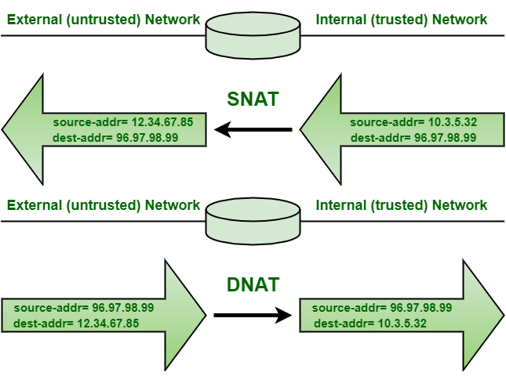

## **SNAT** и **DNAT**

**NAT** - это сокращение от Network Address Translation.  
**NAT** происходит когда один из IP-адресов в заголовке IP-пакета меняется, т.е. либо исходный IP-адрес, либо адрес назначения.  

ПАРАМЕТР|	**SNAT**|	**DNAT**
---------|----------|-----------
Сокращение для |Источник **NAT**|Назначение **NAT**  
Терминология|**SNAT** меняет частный IP-адрес исходного хоста на публичный IP-адрес. Он также может изменить исходный порт в заголовках TCP/UDP. **SNAT** обычно используется внутренними пользователями для доступа к Интернету. |Назначение **NAT** изменяет адрес назначения в IP-заголовке пакета. Он также может изменить порт назначения в заголовках TCP/UDP. **DNAT** используется, когда нам нужно перенаправить входящие пакеты с адресом/портом назначения публичного адреса на частный адрес/порт внутри вашей сети.
Сценарий использования |Клиент внутри ЛВС и за Firewall хочет просматривать Интернет|Веб-сайт, размещенный внутри Центра обработки данных за Firewall и должен быть доступен пользователям через Интернет
Изменение адреса|**SNAT** изменяет исходный адрес пакетов, проходящих через устройство **NAT**|**DNAT** изменяет адрес назначения пакетов, проходящих через маршрутизатор
Порядок операций|**SNAT** выполняется после принятия решения по маршрутизации.|**DNAT** выполняется перед принятием решения по маршрутизации.
Поток коммуникации|Когда внутри защищенной сети инициирует общение с внешним миром, происходит **SNAT**|Когда внешняя незащищенная сеть инициирует общение с внутренней защищенной сетью, происходит **DNAT**
Одиночные/Множественные хосты|**SNAT** позволяет нескольким хостам в "внутренней" сети обращаться к любому хосту в "внешней" сети|**DNAT** позволяет любому хосту в "внешней" сети обратиться к одному хосту в "внутренней" сети
