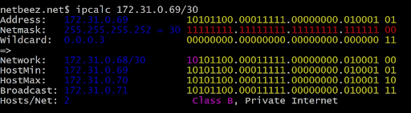

## Адресация. Продолжение

#### Классификация IP

Существует классификация IP-адресов как "частные" и "публичные". Следующие диапазоны адресов зарезервированы для частных (также известных как LAN) сетей:
- *10.0.0.0* — *10.255.255.255* (*10.0.0.0/8*),
- *172.16.0.0* — *172.31.255.255* (*172.16.0.0/12*),
- *192.168.0.0* — *192.168.255.255* (*192.168.0.0/16*).
- *127.0.0.0* — *127.255.255.255* (Зарезервировано для интерфейсов обратной петли (не используется для коммуникации между узлами сети), так называемый localhost)

#### Порты

Стандарт определяет, что для каждого из протоколов **TCP** и **UDP** одновременно можно выделить до 65536 уникальных портов на хосте, идентифицируемых числами от 0 до 65535.
Весь диапазон портов делится на 3 группы:
- от 0 до 1023 называются привилегированными или зарезервированными (используются для системы и некоторых популярных программ)
- от 1024 до 49151 называются зарегистрированными портами.
- от 49152 до 65535 называются динамическими портами.

## **ipcalc**

**ipcalc** - это утилита, которая может выполнять простые манипуляции с IPv4-адресами.
Если просто ввести **ipcalc** без каких-либо опций, вы получите информативный вывод с некоторыми примерами, которые очень помогут вам начать.

#### Примеры использования **ipcalc**

Давайте рассмотрим несколько примеров. Если вы введете IPv4-адрес вашего хоста, вы получите следующий вывод:

**ipcalc** определяет маску подсети хоста, и вывод довольно доходчив.
Приятной особенностью **ipcalc** является то, что он дает двоичные эквиваленты для каждого адреса, что помогает лучше визуализировать его.

Разрыв в двоичной записи разделяет сетевую и хостовую части адреса.

Вы также можете ввести маску подсети в качестве входных данных, и вот простой пример этого:

К сожалению, вы не можете ввести двоичную форму адреса в качестве входных данных **ipcalc** :(

> Маска подсети в формате /5, /24 или /30 представляет собой запись в стиле CIDR (Classless Inter-Domain Routing), которая определяет количество битов, зарезервированных для сети в IP-адресе. Чем меньше число после косой черты, тем больше битов отводится для сети. Например, маска /24 означает, что первые 24 бита IP-адреса отведены для сети, а оставшиеся 8 битов - для устройств в этой сети. Таким образом, маска подсети определяет размер сети и количество доступных IP-адресов в ней. Например, маска /24 предоставляет 256 IP-адресов, в то время как /30 - всего 4 IP-адреса.  
> 
> Чтобы определить количество IP-адресов, предоставляемых маской подсети, можно использовать формулу:  
`количество IP-адресов = 2^(количество бит в маске)`  
В случае с масками подсети, представленными в формате CIDR (Classless Inter-Domain Routing), количество бит в маске равно числу после косой черты.  
> 
> Например:  
Маска /24: 24 бита (32 - 24 = 8)  
Маска /30: 30 бит (32 - 30 = 2)  
> 
> Подставив количество бит в формулу, получаем количество IP-адресов для каждой маски:  
Маска /24: 2^(32 - 24) = 2^8 = 256 IP-адресов  
Маска /30: 2^(32 - 30) = 2^2 = 4 IP-адреса  
Таким образом, маска подсети /24 предоставляет 256 IP-адресов, а маска /30 - всего 4 IP-адреса.  

##### Подсети

Одной из наиболее полезных возможностей ipcalc является его способность вычислять сегменты сети.  
Вот пример того, как это работает, когда мы хотим назначить 10 и 20 адресов двум различным подсетям:

