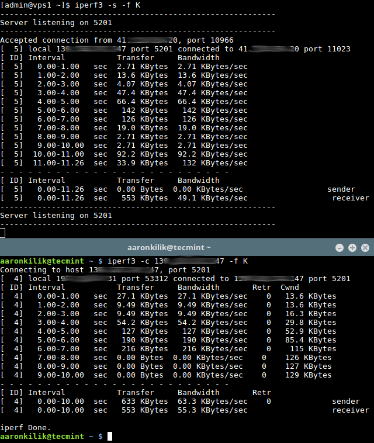

## Скорость соединения

Базовой единицей скорости передачи информации является бит в секунду (bps).

Разница между байтами в секунду (B/s) и битами в секунду (bps) такая же, как разница между байтами и битами: 1 B/s = 8 bps.

Аналогично разница между килобайтами в секунду (KB/s) и B/s такая же, как разница между килобайтами и байтами: 1 KB/s = 1024 B/s. И так далее.

## **iperf3**

**iperf3** - программа для выполнения измерений пропускной способности сети в реальном времени.
Это один из мощных инструментов для тестирования максимально достижимой пропускной способности в IP-сетях (поддерживает IPv4 и IPv6).

Для тестирования пропускной способности сети вам сначала нужно подключиться к удаленной машине, которую вы будете использовать в качестве сервера, и запустить **iperf3** в режиме сервера с использованием флага *-s*, по умолчанию он будет слушать порт 5201.

Вы можете указать формат *(k, m, g для Kбит, Мбит, Гбит или K, M, G для KB, MB, GB)* для отчета, используя параметр *-f* следующим образом.
```iperf3 -s -f K```

При желании вы можете запустить сервер в виде демона, используя флаг *-D* и записывать сообщения сервера в файл журнала, следующим образом.
```iperf3 -s -D > iperf3log```

Затем на вашем локальном компьютере, который мы будем рассматривать как клиент (где фактическое тестирование происходит),
запустите **iperf3** в режиме клиента с использованием флага *-c* и укажите хост, на котором работает сервер (либо используя его IP-адрес, либо доменное имя или имя хоста).
```iperf3 -c 192.168.10.1 -f K```

Через 18-20 секунд клиент должен завершиться и продуктировать результаты, указывающие среднюю пропускную способность для теста, как показано на следующем скриншоте.



Важно: Из результатов теста, как показано на скриншоте выше, есть расхождение значений от сервера и клиента.
Однако вы всегда должны учитывать результаты, полученные с клиентской машины **iperf3** при каждом проводимом тесте.
